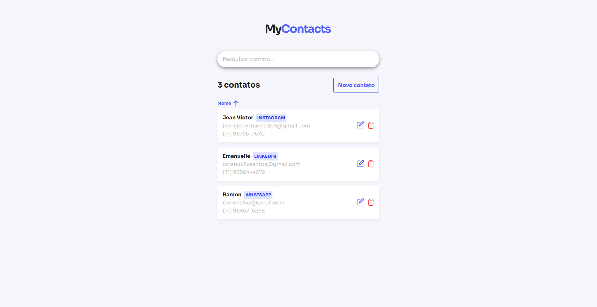
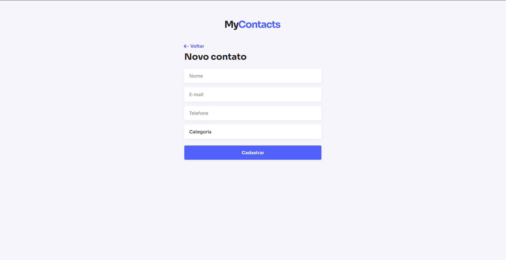
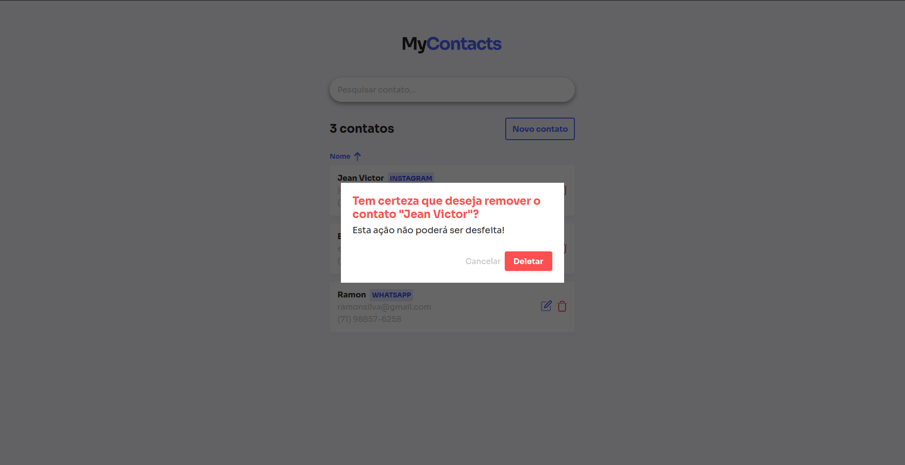

<p align="center">
  
<p>

<p align="center">
  


  <a href="https://github.com/JeanVictor44/Netflix-clone/commits/main">
    
  </a>

  
</p>


## :computer: Sobre o projeto
:phone: O MyContacts te ajuda a gerenciar seus principais contatos, registre um contato de forma simples e visualize quando e onde quiser.



> Página principal

## :art: Layout
<p align="center" style="display: flex; align-items: flex-start; justify-content: center;">
    
    

</p>

## :hammer_and_wrench: Tecnologias

As seguintes ferramentas foram usadas na construção do projeto:

- [React ](https://pt-br.reactjs.org/)
- [React-Router-Dom v6](https://reactrouter.com/docs/en/v6)
- [Styled-components](https://styled-components.com/)
- [Framer Motion](https://www.framer.com/motion/)
- [Axios](https://axios-http.com/docs/intro)
- [Npm](https://www.npmjs.com/)
- [EsLint](https://eslint.org/)


### Ajustes e melhorias

O projeto ainda está em desenvolvimento e as próximas atualizações serão voltadas nas seguintes tarefas:

- [x] Criar Página de visualização do contatos
- [x] Criar página para registro de contatos
- [x] Criar página para atualização de contatos
- [x] Criar modal de exclusão de contato
- [x] Conectar Front-end com Backend

## :rocket: Como executar o projeto

Este projeto consome uma API exclusiva para ele, portanto sugiro que dê uma olhada no repositório [my-contacts-backend](https://github.com/JeanVictor44/my-contacts-backend) para aprender a configurar o Backend do projeto


## Pré-requisitos

Antes de começar, você vai precisar ter instalado em sua máquina as seguintes ferramentas:
[Git](https://git-scm.com), [Node.js](https://nodejs.org/). Além disto é bom ter um editor para trabalhar com o código como [VSCode](https://code.visualstudio.com/)

### :coffee: Rodando a aplicação

```bash
# Clone este repositório
$ git clone https://github.com/JeanVictor44/my-contacts-frontend

# Acesse a pasta do projeto no seu terminal/cmd
$ cd my-contacts-frontend

# Instale as dependências
$ npm install
      ou
$ yarn

# Execute a aplicação em modo de desenvolvimento
$ npm run start
      ou
$ yarn dev

# A aplicação será aberta na porta:5173 - acesse http://localhost:5173/
```


## :pencil: Licença

Esse projeto está sob licença. Veja o arquivo [LICENÇA](LICENSE) para mais detalhes.
